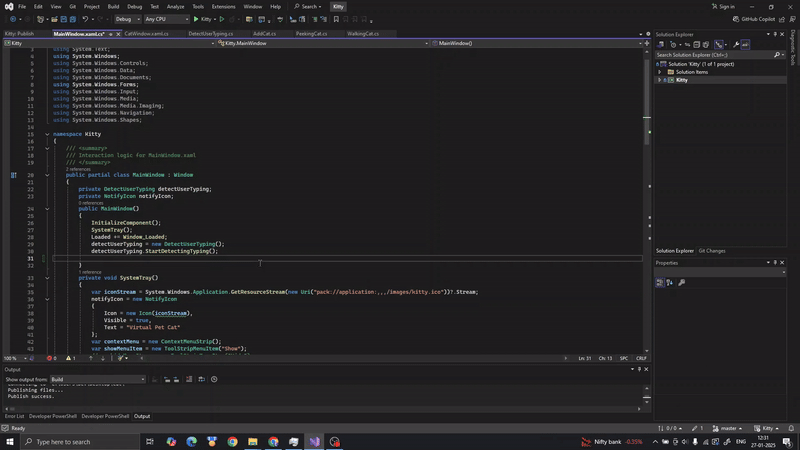
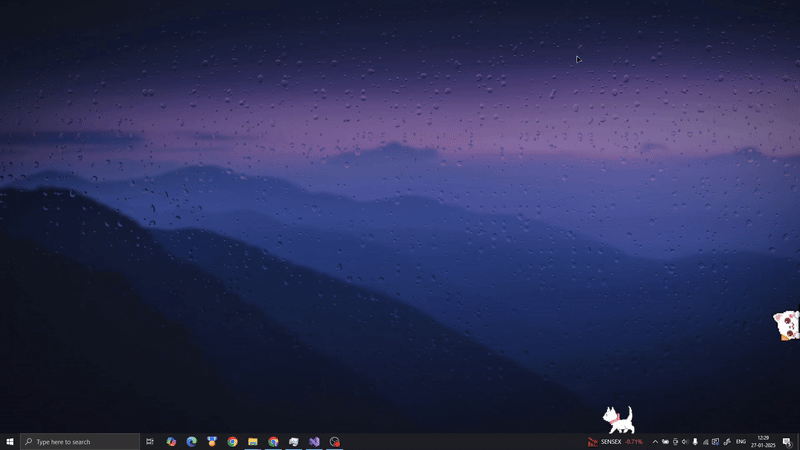

# Virtual Pet Cat

A fun and interactive Virtual Pet Cat application built using C# and WPF, where users can take care of their own digital feline companion.

How to Run the Application

Clone the repository:

```git clone https://github.com/2Rahul2/VirtualPetCat.git```

- Open the project in Visual Studio.
- Restore NuGet packages (if any).
- Build and run the application.

## Cat Types With You


## Walking and peeking cat to keep you company


